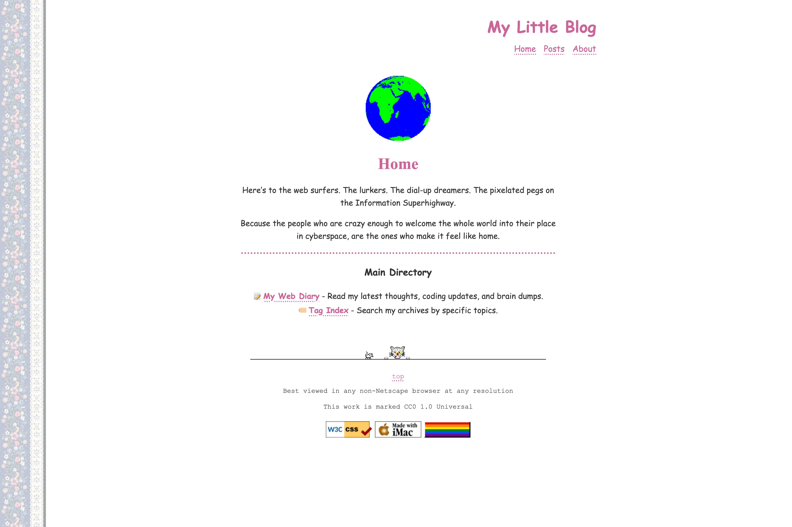
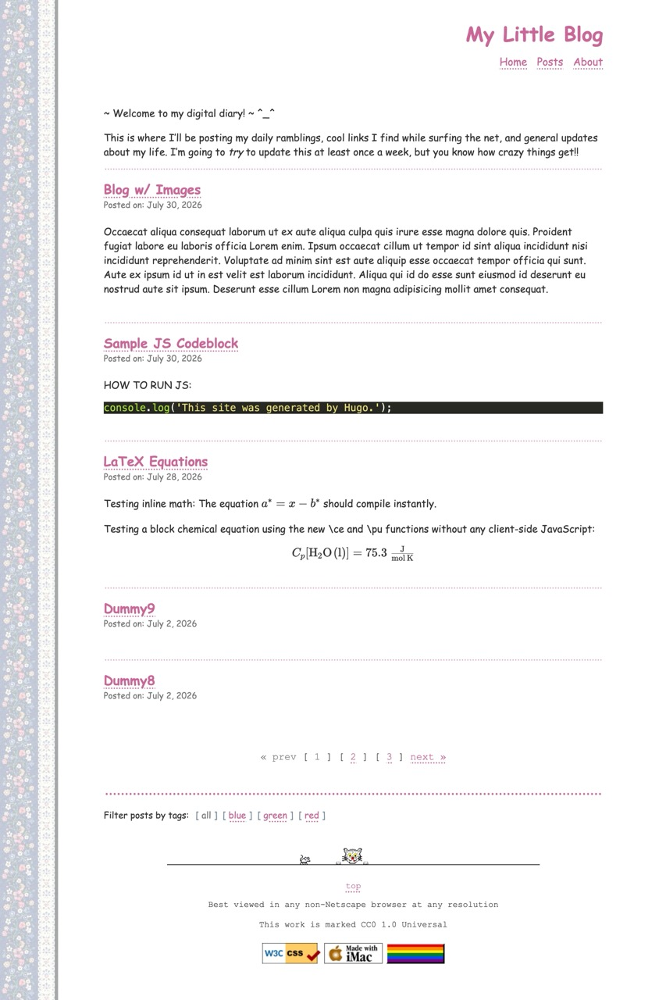
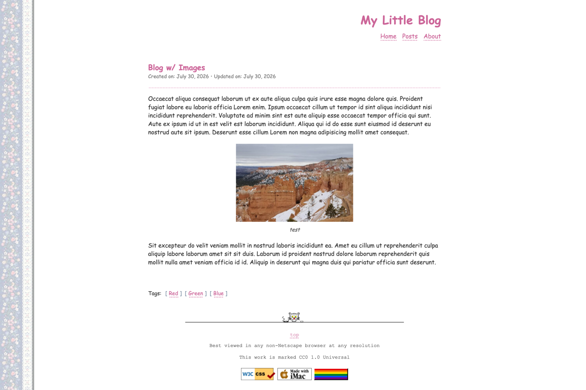

<!--- /*
SPDX-FileCopyrightText: 2026 Claire Tam <clare.tt@posteo.de>
SPDX-License-Identifier: MIT
*/ -->
# Floral Cities
  
A cute, small, geocities-esque theme for Hugo.

<!-- markdownlint-disable MD033 MD013-->
<div style="margin-bottom: 8px;">  
    
</div>  
  
<div style="width: 100%; white-space: nowrap;">  
    
  <!-- The 1% gap logic: we reduce the 2nd image slightly to create a margin without triggering line-wrap -->  
    
</div>
<br>

Try here: <https://fractuscontext.github.io/floral-cities>
  
## Supported Features
  
- [x] KaTex Support, see [link to example page]
- [x] Web 1.0 88x31px badges (with local import or external link support)
- [x] Dynamic, retro-styled tag filtering bar (`[ all ] [ tag 1 ] [ tag 2 ]`)
- [x] Smart pagination (`« prev [ 1 ] ... [ 50 ] next »`)
- [x] Custom Y2K styled 404 Error page
- [x] Mobile Responsive: Looks like it's from 1999, but works perfectly on modern smartphones.
- [x] Tags still supported
- [x] Support pic captions
  
## Not Supported
  
- [ ] Dark Mode
  
## Installation
  
**Prerequisite:** Ensure you are running Hugo version **`0.146.0`** or higher (the extended version is not required).
  
From the root of your Hugo site, clone the theme into your `themes` directory:
  
```bash
git submodule add https://github.com/fractuscontext/floral-cities.git themes/floral-cities 
```

## Configuration & Options
  
Floral Cities is highly customizable through the `theme/hugo.toml` file. Below is the standard configuration to get your personal cyberspace up and running.
  
### Homepage Configuration
  
Edit `$BLOG_DIR/content/_index.md` to personalize your welcome message and landing page.
  
### Overriding the HomePage Hero Image
  
`params.header_image` sets the global header. Override or remove it for specific pages via their front matter:
  
```toml
+++ 
title = 'My Custom Homepage' 
date = 2026-06-28T20:00:00+09:30 
 
[params.header_image] 
path = "images/another_gif.gif" # Omit the path to remove the image completely 
alt = "Custom Image" 
+++ 
```
  
### Customizing the Footer
  
- **Divider:** Set `params.retro_footer.separator_image` for a custom image divider. If omitted, it defaults to a standard `<hr>`.
- **Badges:** Add 88x31px buttons via `params.retro_footer.badges`. Supports local assets or external URLs. Delete the array in your config to remove them entirely.
- **Message:** Add copyright or contact info using `params.retro_footer.lines`. Pass an array of strings, using `""` for line breaks.
  
### Pagination Setup

To configure the number of posts displayed per page, add the following to your site's root `hugo.toml` (not `themes/floral-cities/hugo.toml`):
  
```toml
[pagination] 
pagerSize = 5
```  
  
### Enabling LaTeX Rendering

To enable proper parsing for mathematical equations (KaTeX), you will also need to update your site's root `hugo.toml` with the following markdown configurations:

```toml
[markup] 
  [markup.goldmark] 
    [markup.goldmark.renderer] 
      unsafe = true 
 
  [markup.goldmark.extensions] 
    [markup.goldmark.extensions.passthrough] 
      enable = true 
      [markup.goldmark.extensions.passthrough.delimiters] 
        block = [['\[', '\]'], ['$$', '$$']] 
        inline = [['\(', '\)']] 
```  

## License

MIT
